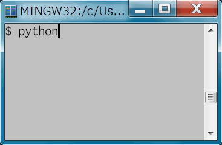

# name2vec

a light word2vec model which has about 46,000 person names

## How to use

## Process

    source/jawiki-20170201-pages-articles-multistream.xml.bz2
    (https://dumps.wikimedia.org/jawiki/20170201/)
      |
      | WikiExtractor.py
      | (https://github.com/attardi/wikiextractor)
      v
    corpus/AA/wiki_*
      |
      | extractnames.py
      v
    names.txt
      |
      | train.py
      v
    names.bin
